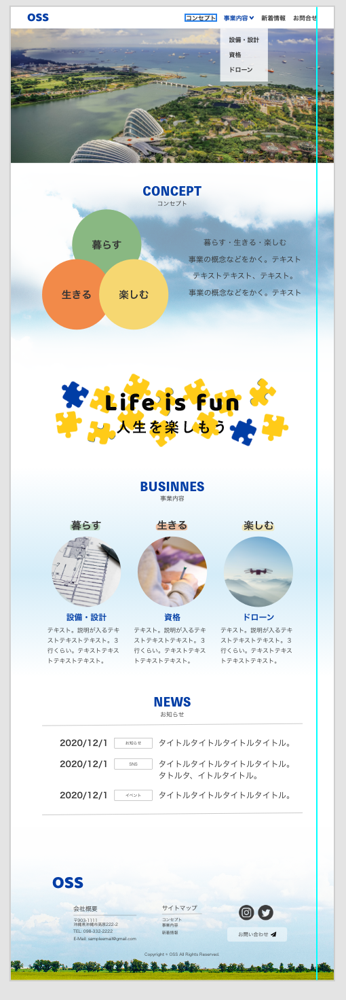

# OSS Web サイト制作

## 概要

この Web サイトは練習用に制作する。
コーディングのみ行う。
CSS の設計手法の１つでする PRECCS を採用し、かつレスポンシブに対応させる。

## PRECSS 設計

1.  ベース

    a. サイト内で共通であるべきもの

    b. サイトのベースとなってほしいいもの

    c. 接頭辞なし

2.  レイアウト

    a. 接頭辞: ly\_

    b. ヘッダー、ボディエリア、メインエリア、サイドエリア、フッター等の大きなレイアウトに使用

    c. レイアウトに関わるスタイリング(width, margin, padding, float など)のみ行う

    d. コンテンツが入る「枠」を定義するだけ

3.  モジュール

    a. ブロックモジュール

        ① 接頭辞: bl_
        ② 複数の子要素やエレメントモジュールを持つBlock
        ③ レイアウトに関わる（width, float等）スタイリングはしない。例外として上下間の余白は許容。

    b. エレメントモジュール

        ① 接頭辞: el_
        ② ボタンやラベル、見出しなどの最小単位のモジュール
        ③ 基本的にレイアウトに関わるスタイリングは行わないが、width指定とモディファイアは許容
        ④ モディファイア
          (a) 命名規則: クラス名__モディファイア名
          (b) あしらいが変わる
          (c) 大きさが変わる
          (d) 一定の規則に従って振る舞いが変わる

4.  ヘルパー

    a. 接頭辞: hp\_

    b. Emmet のショートハンドに準じた命名（i.e. hp_marginTop10 ⇨ hp_mt10）

    c. 小数点はアンダースコア

    d. ネガティブな値は key を大文字

5.  ユニーク

    a. 接頭辞: un\_

    b. ある 1 ページでしか使用されないことを明示する
    グループ

6.  プログラム

## デザインカンプ

### 参考サイト

- https://www.itochu.co.jp/ja/?fbclid=IwAR3InInzwHJs9SnglCh5sEtP3ucWrAICM_WCJh3ALJksU_HevROvf6mSyJY
- https://www.ana.co.jp/?fbclid=IwAR3TSNryazci7hhATDNgXdZ36DfFfYvgHLuEdnkJyqcnTZ0xbmJazmgHBvw

## 著者

---

[IT)

- GitHub: [@IT](https://github.com/Ikko-T)

## ライセンス

---

(C)Copyright 2021 IT

This web site is under [MIT license](https://en.wikipedia.org/wiki/MIT_License).

<!--

Name
====

Overview

## Description

## Demo

## VS.

## Requirement

## Usage

## Install

## Contribution

## Licence

[MIT](https://github.com/tcnksm/tool/blob/master/LICENCE)

## Author

[tcnksm](https://github.com/tcnksm)
-->
