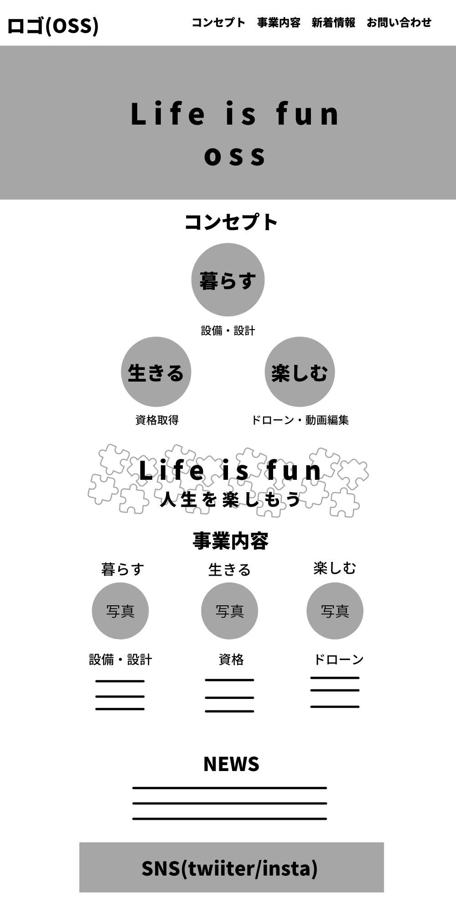

# OSS Webサイト制作

## 概要
コンセプトは「人生を楽しもう」

## 完成イメージ

### 参考サイト
- https://www.itochu.co.jp/ja/?fbclid=IwAR3InInzwHJs9SnglCh5sEtP3ucWrAICM_WCJh3ALJksU_HevROvf6mSyJY
- https://www.ana.co.jp/?fbclid=IwAR3TSNryazci7hhATDNgXdZ36DfFfYvgHLuEdnkJyqcnTZ0xbmJazmgHBvw

<!--

Name
====

Overview

## Description

## Demo

## VS.

## Requirement

## Usage

## Install

## Contribution

## Licence

[MIT](https://github.com/tcnksm/tool/blob/master/LICENCE)

## Author

[tcnksm](https://github.com/tcnksm)
-->
